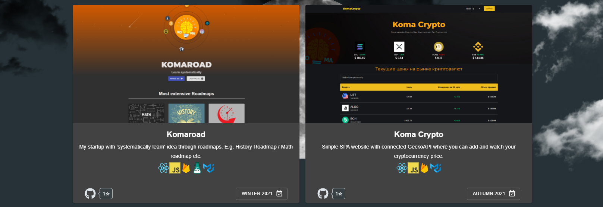

[](https://www.npmjs.com/package/repository-metrics)
[](https://standardjs.com)


# Repository metrics for ```react``` 


## This beauty and easy ``(4KB)`` react component can help you ``add metrics`` to your repositories also you can ```change component theme on light/dark```
----
## Install:
```bash
npm i repository-metrics
---
yarn add repository-metrics
```

## Usage:
```jsx
// don't forget change props
import { RepositoryMetrics } from 'repository-metrics';

const App = () => {
  return (
    <div>
      <RepositoryMetrics 
      owner='Ivan-Corporation' 
      repo='Komolio' 
      theme='light' 
      />

      <RepositoryMetrics 
      owner='Ivan-Corporation' 
      repo='3D-Planet-destroyer' 
      theme='dark' 
      />
    </div>
  );
};
```


## Examples:
---




## Check demo here:
### https://komolio.netlify.app/projects


---
## Props:

| props  | required | default  | description |
| ------------- | ------------- | ------------- | ------------- |
| owner(string)| yes | - | your github account username |
| repo(string) | yes | - | your repository name|
| theme(string) | yes | - | theme for component (light/dark) |
